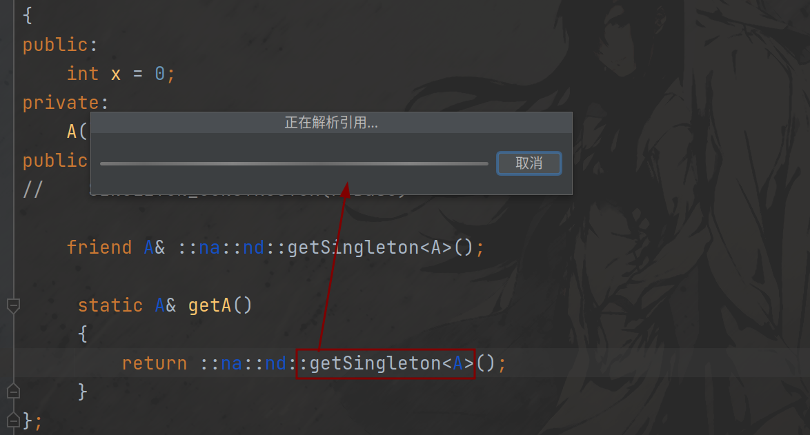
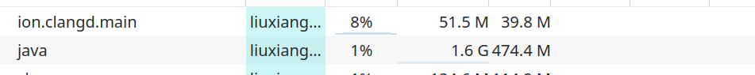
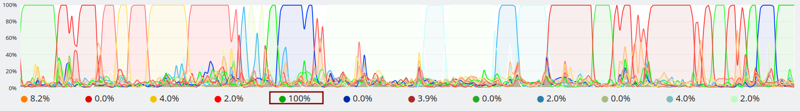

## What is this
This is an example reporting a bug in CLion-embeded clangd. If you have found a solution to solve this bug or found that it's the author's fault, please contact the author(<lxzbuaa@126.com>), thanks.
## Environment
+ OS: Manjaro Linux x86_64 
+ Kernel: 5.15.108-1-MANJARO 
+ DE: Plasma 5.27.4 
+ WM: KWin
+ CPU: AMD Ryzen 5 4600H with Radeon Graphics (12) @ 3.000GHz 
+ GPU: AMD ATI 05:00.0 Renoir 
+ GPU: NVIDIA 01:00.0 NVIDIA Corporation TU117M 
## CLion Version
2023.1 and 2022.1.3 (The bug was first found in version 2022.1.3 and still exists after updating to the latest version)
## Problem
This example can be correctly compiled and run, but when it's opened in CLion, the following things will happen.
**CLion gets stuck while trying to jump to definition**  
  
After I left click the `getSingleton` pressing `ctrl` meanwhile, CLion got stuck.  
**clangd may got into a dead loop**  
  
  
I turn on my system monitor and find that `clangd` takes 8 percent of my CPU usage which also means it occupied one whole core of my CPU. But CLion(denotes as `java` in monitor) takes low CPU usage.  
Base on above, I guess the bug is trigger in a sequence as below:
+ CLion create a child process clangd
+ clangd gets into a dead loop
+ CLion try to get the definition of getSingleton so it calls (and waits for) clangd, sas a result it also get stuck

However, if I just copy&paste all content of b.h into a.h instead of using `#include`, everything works well.
